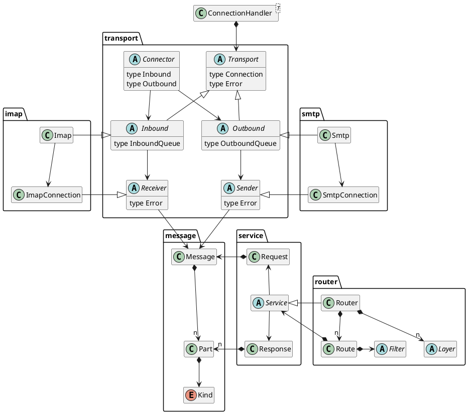

```plantuml
@startuml
hide empty members

package transport {
    abstract Connector {
        type Inbound
        type Outbound
    }
    abstract Transport {
        type Connection
        type Error
    }
    abstract Receiver {
        type Error
    }
    abstract Sender {
        type Error
    }
    abstract Inbound {
        type InboundQueue
    }
    abstract Outbound {
        type OutboundQueue
    }

    Connector -d-> Inbound
    Connector -d-> Outbound

    Inbound -u-|> Transport
    Outbound -u-|> Transport

    Inbound --> Receiver
    Outbound --> Sender

}

package message {

    class Message
    class Part
    enum Kind

    Message *-d--> "n" Part
    Part *-d-> Kind
}

Sender --> Message
Receiver --> Message

package imap {
    class Imap
    class ImapConnection

    Imap -d-> ImapConnection
}

Imap -r-|> Inbound
ImapConnection -r-|> Receiver

package smtp {
    class Smtp
    class SmtpConnection

    Smtp -d-> SmtpConnection
}

Smtp -l-|> Outbound
SmtpConnection -l-|> Sender

package service {
    class Request
    class Response
    abstract Service

    Service -u-> Request
    Service -d-> Response
}

Request *-l-> Message
Response *-l-> "n" Part

class ConnectionHandler<T>

ConnectionHandler *-d-> Transport

package router {
    class Route
    class Router
    abstract Filter
    abstract Layer

    Router *-d-> "n" Route
    Router *-d-> "n" Layer
    Route *-r-> Filter
}


Router -l-|> Service
Route *-l-> Service

@enduml
```

