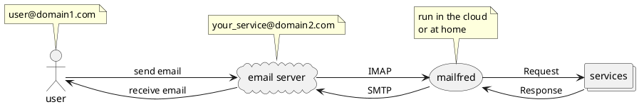

```plantuml
@startuml
left to right direction

actor user
cloud "email server" as server
storage mailfred
collections services

note "user@domain1.com" as email_user
note "your_service@domain2.com" as email_server
note "run in the cloud\nor at home" as mailfred_note

email_user -r-> user
email_server -r-> server
mailfred_note -r-> mailfred

user --> server : send email
user <-- server : receive email
server --> mailfred : IMAP
server <-- mailfred : SMTP
mailfred --> services : Request
mailfred <-- services : Response

@enduml
```
